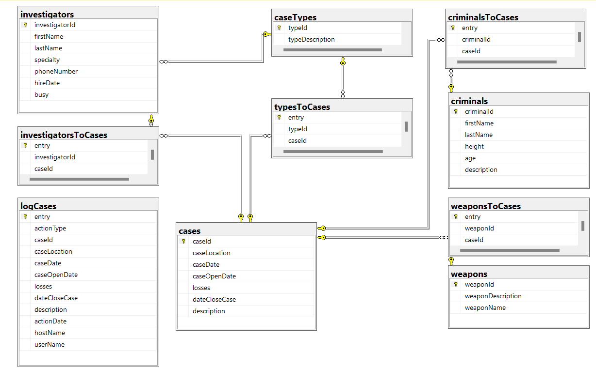

# SQL server final project:
## Project Overview:
The database I created for this project is a basic prototype of what a police force might have to keep track of cases in the city or country, and to cross reference information about them in order to find trends and better ways to stop crimes.
The database in my project lacks a lot of functionality and tables that would probably be needed in a real-life version, but as I said before, this is just a prototype.

## Table of contents and guide to project folder.
1.	database diagram (file name: criminalCasesDiagram) - the diagram of the database
2.	Building the database (file name: build and add data) - the code I originally used to build the database.
3.	Functions, views, procedures, and triggers (file name: functions procedures views triggers and usage) - the code I originally used to build the functionality of the database and test it.
4.	Database script file - the code to recreate the database - including data insertion. 

## Full DataBase Overview
### The major tables:
**Cases**: 
The main table in the DB, is used for keeping the basic info about every case (where and when it happened, what were the losses and so on)

**Criminals**: 
Used for keeping track of basic info about every criminal the force has encountered before.

**Investigators**: 
Keeps track of the investigators currently working for the force and their basic info.

**Weapons**: 
A minor table used for keeping track of the different weapons that might be used in a crime scene.

**Case Types**: 
Another minor table used to ensure that all case types are standardized, and also allows the association of one crime with many types.

**logCases**: 
A log table on cases table
### The cross-reference tables:

**TypesToCases**: 
An entry for every association between case and type.

**InvestigatorsToCases**: 
An entry for every investigator on every case they were assigned to.

**CriminalsToCases**: 
An entry for every criminal on every case they were proven to commit.

**WeaponsToCases**: 
An entry for every weapon on every case where it was used.

### The database Diagram:

### The Views:
-	**combinedCaseData**: A view that combines all the available data about a case into one table.
-	**criminalsToCrimeTypes**: A view that creates an alignment between criminals and the types of crimes they have committed.
-	**most_wanted**: Creates a rating of criminals based on the number of cases they have been associated with.
-	**first_two_cases**: Creates an alignment between every investigator to their first two cases.
### The Procedures:
-	**PR_add_case**: The procedure receives the info about a case, adds it to case table and adds cross reference information about the weapons used, and the types of the case.
-	**PR_assign_investigators**: The procedure receives a caseId and the number of desired investigators on the case, and then assigns relevant investigators to the case by saving an entry in the investigatorsToCases table and sets the busy column for those investigatros to true. The procedure uses the FN_recommend_Investigators function to find relevant investigators.
-	**PR_close_case**: The procedure assigns a close date to the given case and marks the investigators on that case as not busy.
-	**PR_solve_case**: The procedure receives a case Id, and the Ids of the criminals involved and creates cross reference entries in the criminalsToCases table.
### The Functions:
-	**FN_possible_suspects**: The function receives a case Id, and returns a table with the possible suspects from the criminals known to the force, based on their involvement in similar cases in the past (using the criminalsToCrimeTypes  view)
-	**FN_recommend_Investigators**: The function receives a case Id and recommend investigators based on their specialty; this function is used  in the assignInvestigagators procedure.
-	**FN_which_criminal_to_catch_first**: The function receives to criminal ids and decides which one is more wanted based on the most_wanted  view.
### The triggers:
-	**newCase**: When a new case is added to the database, the trigger saves the information in the database log.
-	**deleteCase**: When a case is deleted from the database, the trigger saves the information in the database log.
-	**updateCase**: Does the same for updates, but the data is saved in two rows, one from the delete history, and the other from the insert history, this implementation might seem redundant to some, but it might be helpful when trying to isolate updates (which might happen a lot I this database as the case unfolds)
